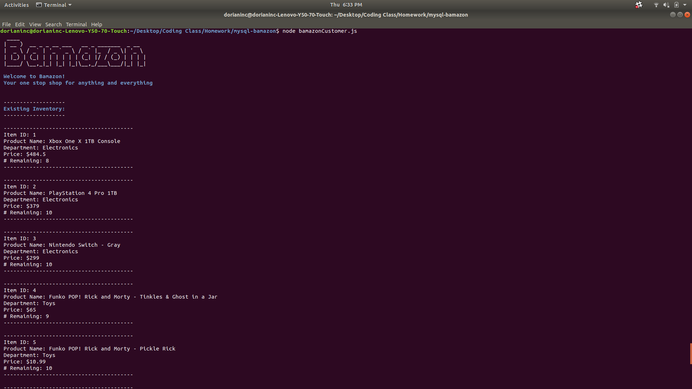
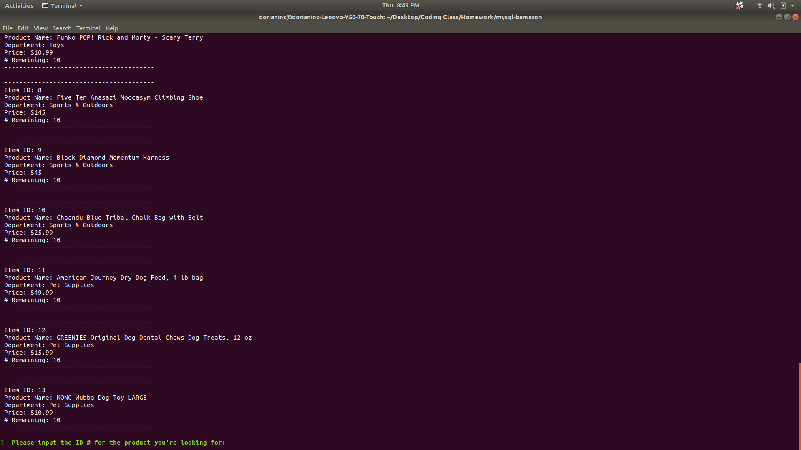
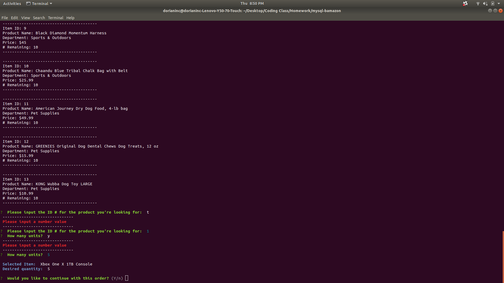
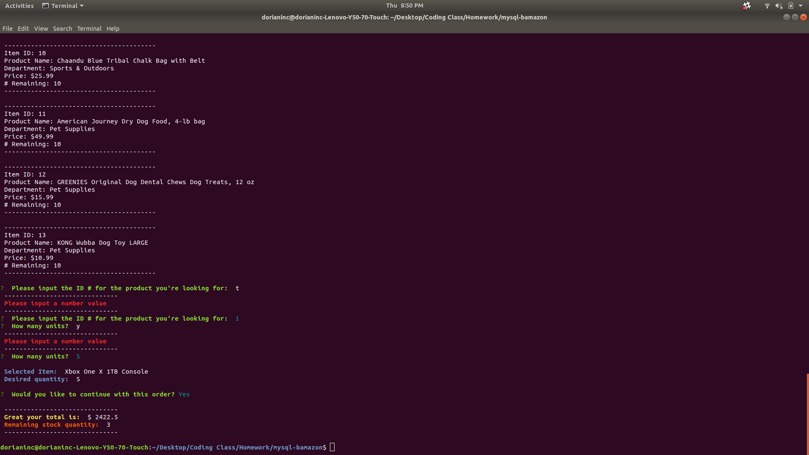
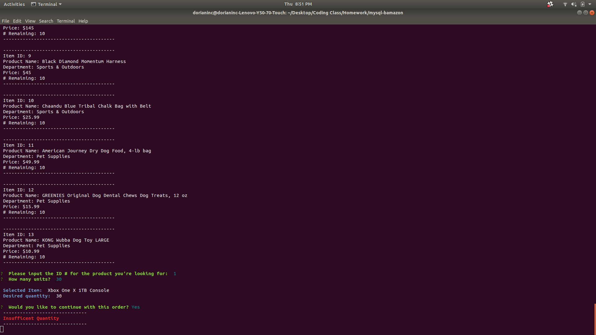

# mysql-bamazon

 Step One, Initialize app

 

 Step Two, App request you input item ID and desired quantity

 

 If user doesn't input a number the app notify's them

 

 Step Three, You are given the option to confirm your order

 If there is enough quantity in stock, order is pushed

 

 If desired quantity exceeds stock quantity user is notified

 